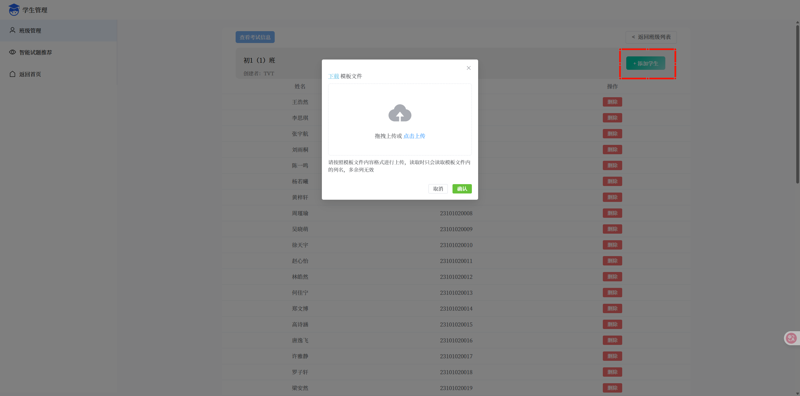
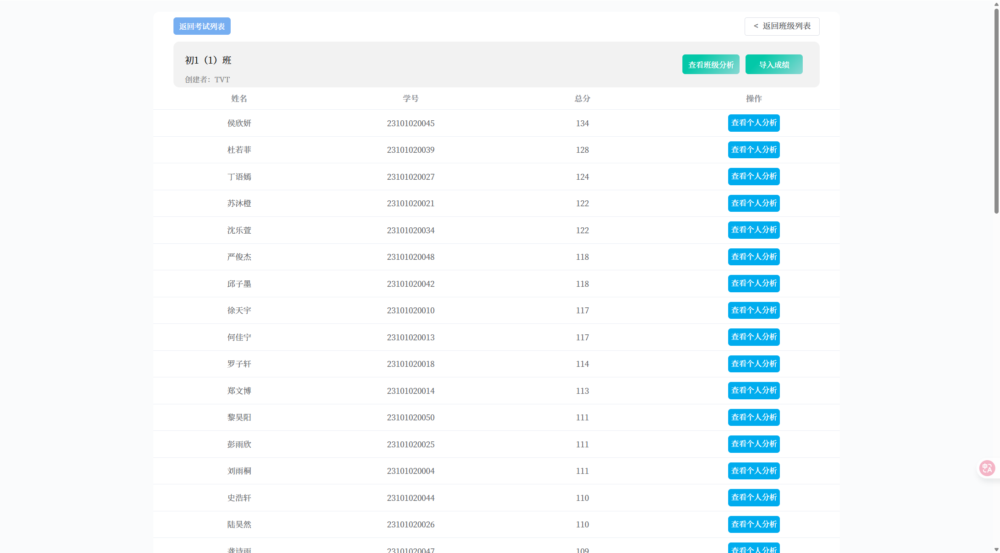
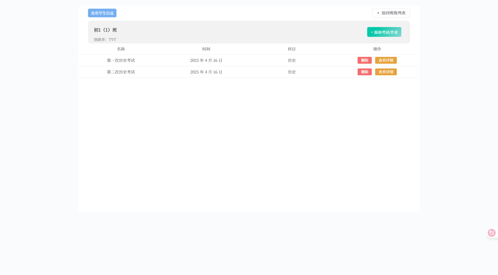
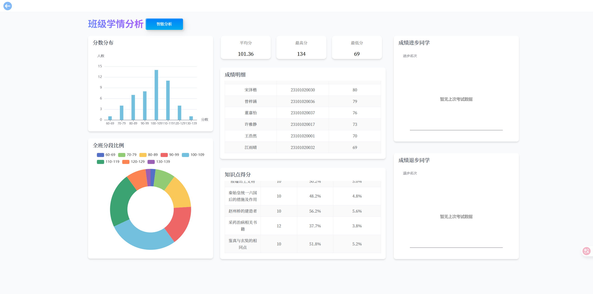
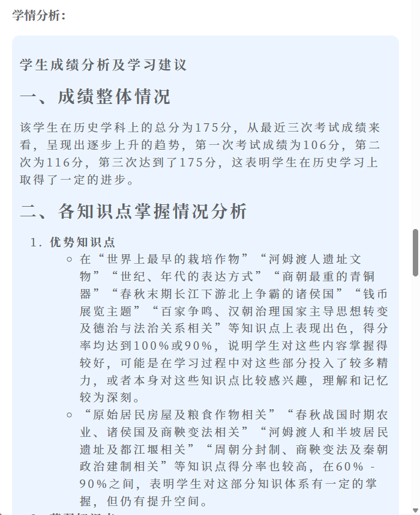
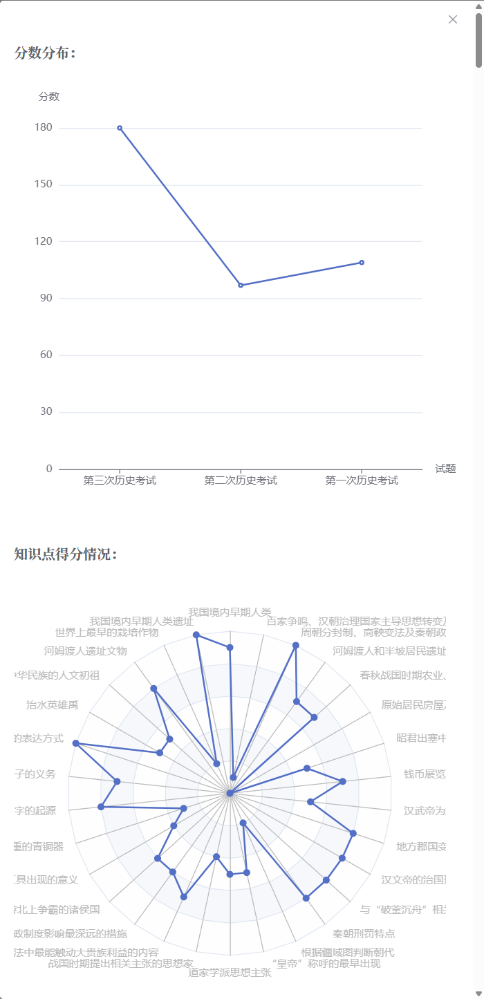
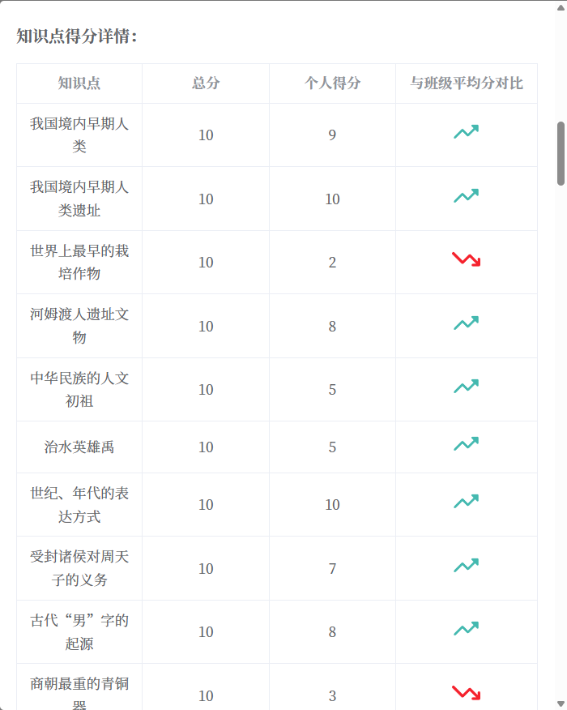

# 学情分析

## 班级管理

:::tip 新增班级
点击“新增班级”，输入年级和班级信息即可完成创建。
:::

进入班级管理后，您可以进行以下操作：

*   **获得学生信息**
    :::info 添加学生
    点击“添加学生”，您可以导入包含学生名单的文件。页面左上角提供了文件模板供您参考。
    :::
    
    
*   **获得考试信息**
    :::info 查看与导入成绩
    点击“查看考试信息”，可以浏览班级考试的科目与时间。在“查看详细信息”中，点击“导入成绩”以上传学生分数。导入后即可查看所有学生的分数情况。
    :::
    
    *   **查看班级分析**：可视化展示班级整体成绩情况，并通过“AI分析”总结班级学习状况。
    
    *   **查看个人分析**：通过图表和AI学情总结，分析单个学生的学习情况。
    
    
    

:::info 视频演示
此处可以嵌入教学视频，演示具体操作流程。
[视频链接或嵌入代码待添加]
:::

## 智能试题推荐

:::tip 如何使用
在搜索栏中输入试题描述、关键词等信息，系统将为您推荐相关试题。
:::
